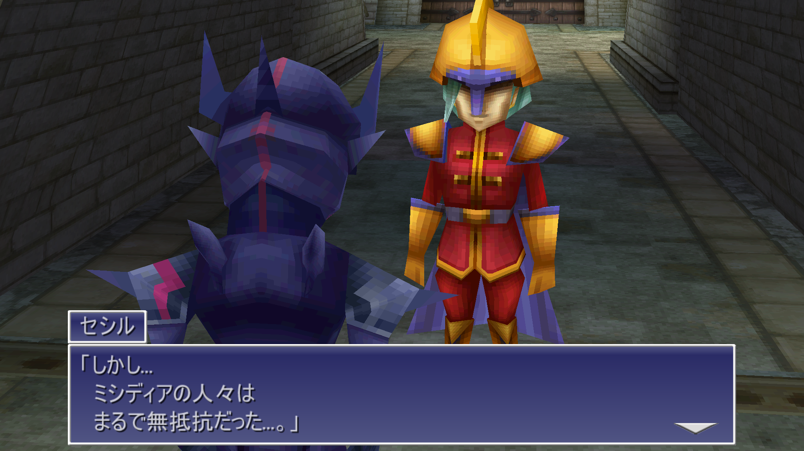
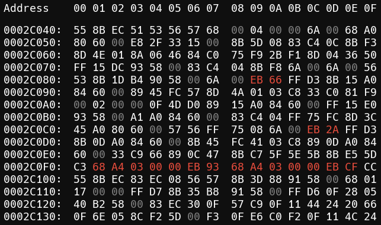

# Final Fantasy IV Name Patcher

This is a patcher for Final Fantasy IV (3D Remake) for playing in Japanese on a non-Japanese version of Windows.

Without using this, the character's names show as jumbled text in the game. For example, Cecil's name shows as ƒZƒVƒ‹ instead of セシル:


After applying this patch, the character names will show properly:



See the [explanation](#explanation) below for more details on what the patch does.

> [!NOTE]
The patcher will automatically backup your existing executable to `FF4.exe.original`.

## Instructions

- Download [`ffiv-name-patcher.exe`](https://github.com/blacktide082/ffiv-name-patcher/releases/latest) from the Releases section.
- Copy/move the `ffiv-name-patcher.exe` file to the root of your game's installation directory.
- Double click the patcher to open it.
- You're done! Run the game to ensure the names are working properly.

## Manually Running the Script

If you prefer not to run the executable, you can manually run the script.

- Ensure you have Python 3.11+ installed.
- Open a terminal or Powershell window, and change directory to your Final Fantasy IV's game installation. 
- Execute the following commands

```bash
curl -OL https://raw.githubusercontent.com/blacktide082/ffiv-name-patcher/master/patch.py
python patch.py
```

## Manually Patch the Executable with a Hex Editor

If you want to manually apply the patch with a hex editor you can follow the steps below.

- Create a backup of `FF4.exe`.
- Open `FF4.exe` with your favorite hex editor (I recommend [ImHex](https://github.com/WerWolv/ImHex/releases/latest) if you don't have one).
- Navigate to offset `2C089`, or search for `6A 00 FF D3` and navigate to the first result.
- Replace `6A 00` with `EB 66`.
  > Note: There are two sequences of `6A 00` before `FF D3`, ensure you are only replacing the two bytes directly before `FF D3`.
- Navigate to offset `2C0CC`, or the second result for `6A 00 FF D3`.
- Replace `6A 00` with `EB 2A`.
- Navigate to `2C0F0` and replace `C3 CC CC CC CC CC CC CC CC CC CC CC CC CC CC CC` with `C3 68 A4 03 00 00 EB 93 68 A4 03 00 00 EB CF CC`.
- Save the file.

The following image shows the 3 locations that need to be modified:



## Explanation

All of the character's names are stored as constant strings in the game's executable file and are encoded with the Shift-JIS encoding.

The game uses the Windows API [`MultiByteToWideChar`](https://learn.microsoft.com/en-us/windows/win32/api/stringapiset/nf-stringapiset-multibytetowidechar) to convert these strings from Shift-JIS to UTF-16, but it does so by using codepage `0`, which uses the system's codepage (which is only Shift-JIS on Japanese versions of Windows).

This patches the first parameter of the calls to `MultiByteToWideChar` to `932`, which is the codepage for Shift-JIS.

## Building

To build the program into a single executable, ensure you have Python 3.11+ with pyinstaller installed, and run the `build.bat` file:

```batch
pip install pyinstaller
.\build.bat
```